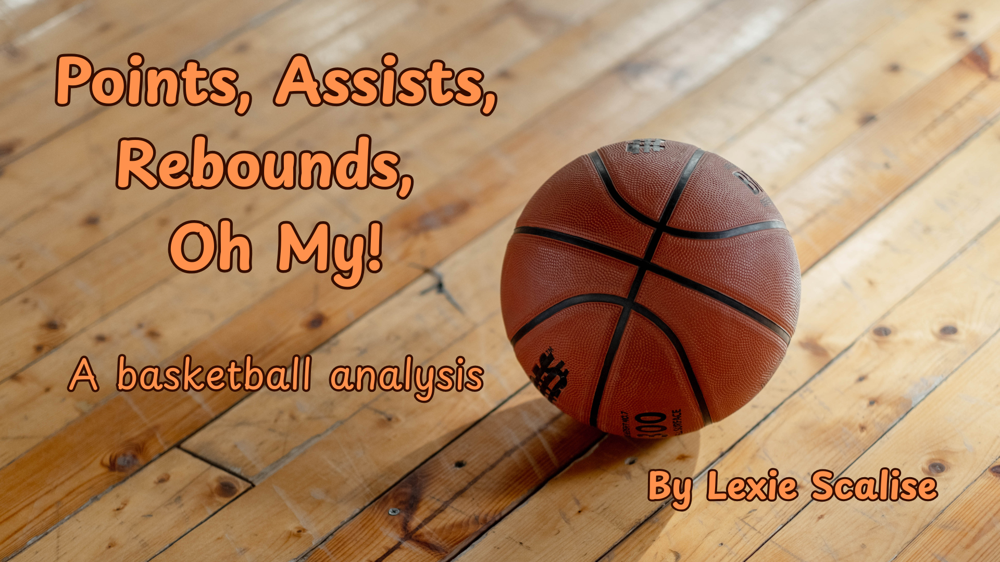

# Points, Assists, Rebounds, Oh My!

## Introduction

What I learned from this project was:
  1.
  2. 
  3. 
  4.

## The Data
The data from this project comes from the Harvard Dataverse <a href="https://dataverse.harvard.edu/dataset.xhtml?persistentId=doi:10.7910/DVN/KRQMKU">website</a>. This website shows the Billboard ANnual Charts from 1946-2023.  
This data set contains 7004 rows and 12 columns, where each row represents song ranking and the columns contain information like genre, ASACP Songwriter, BMI Songwriter, and year. I used PowerBI to create visualizations using this data.

## Analysis

I answered **4** questions related to professional basketball:
  1. Who had the number one spot in the charts by the end of each year?
  2. Which artists made the number one spot more than once?
  3. Did BMI or ASCAP songwriters have the most number one hits?
  4. What genre made the number one spot and how did they change throughout the decades?

### Track 1
The first question asks: "Who had the number one spot in the charts by the end of each year?" 
  

### Track 2
The second question is, "Which artists made the number one spot more than once?" I answered this by creating a 

### Track 3
Question three asks, "Did BMI or ASCAP songwriters have the most number one hits?" I answered this by using a 

### Track 4
The last question asks, "What genre made the number one spot and how did they change throughout the decades?" 

## Conclusion

If you would like to connect, please reach out to me on <a href="https://www.linkedin.com/in/lexie-langella/">LinkedIn</a>! 
